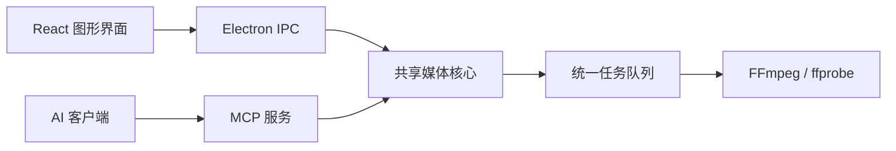

# Muxivra 项目设计与开发交接

更新日期：2026-10-05  
文档用途：保存 2026-10-05 的原始设计基线。文中进度与待确认项是当时的记录；当前实现及验证结果见 [架构](ARCHITECTURE.md) 与 [验收记录](VERIFICATION.md)。

## 1. 项目定位与约束

构建一个基于 Electron 的桌面媒体工具，通过现代化图形界面调用外部 FFmpeg，提供视频／音频转码、封装、轨道处理和简单字幕编辑、打轴功能。

用户明确提出的要求：

- 使用 Electron 构建桌面应用。
- 界面现代化，设计风格统一。
- 单文件处理和批量处理使用独立的界面与操作流程。
- 提供简单字幕编辑、打轴能力。
- 不涉及视频特效、视频剪辑、多轨合成等非线性编辑功能。
- 项目遵循 GPL v3。
- 应用安装包不携带 FFmpeg，应用调用用户已有或运行后另外获取的 FFmpeg。
- 希望提供 MCP 服务器，让 AI 客户端通过自然语言调用媒体处理能力。

本文将前述技术建议整理为开发基线。项目名称、首发平台范围、视觉细节、引擎构建源等尚未由用户逐项确认的内容，会注明为推荐或待确定；构建时可按推荐推进可逆工作，不必重新进行整套技术选型。

## 2. 名称与许可证

### 2.1 工作名称

- 产品工作名：**Muxivra**。
- 仓库／包名建议：`muxivra`。
- `Mux` 呼应媒体封装与流复用，后半部分采用造词。

前期对名称进行了公开网络精确搜索，并针对 GitHub、GitLab、Gitee、npm 的公开索引检索，未发现同名项目。平台 API 当时未能连通，因此只完成了公开索引范围的初步查重；未确认商标、域名或未收录项目的情况。正式公开发布前应再核对一次。用户尚未明确确认最终名称。

### 2.2 许可证基线

- 应用代码建议使用 **GPL-3.0-only**，对应用户指定的 GPL 第 3 版。
- 仓库放置标准 GPLv3 许可证全文，包元数据写明许可证。
- 发布应用二进制时，提供对应版本的源代码及必要构建脚本。
- 第三方依赖保留各自的许可证与版权声明，建立第三方许可清单。
- FFmpeg 保留其构建对应的许可证；不把第三方组件的原有许可声明统一改写为 GPL。
- 若未来自建 FFmpeg 下载镜像或重新打包引擎，需按该构建的许可证履行相应分发义务。
- 不分发通过 `--enable-nonfree` 生成的不可再分发 FFmpeg 构建。

## 3. 技术栈

| 层级 | 选型 | 用途 |
| --- | --- | --- |
| 桌面框架 | Electron | 桌面窗口、应用生命周期、系统集成 |
| 前端语言 | TypeScript | 界面与交互逻辑 |
| 前端框架 | React | 单文件、批量处理、字幕编辑页面 |
| 界面组件 | shadcn/ui | 可定制的基础组件 |
| 样式 | Tailwind CSS + CSS 变量 | 统一设计变量与明暗主题 |
| 本地服务语言 | TypeScript | 引擎管理、任务调度、参数生成、文件操作 |
| 本地运行环境 | Electron 的 Node.js 环境 | 本地服务运行 |
| 媒体引擎 | FFmpeg + ffprobe | 媒体分析与处理 |
| 构建工具 | electron-vite | 主进程、预加载脚本和前端构建 |
| 安装包工具 | electron-builder | 应用打包与分发 |
| MCP | 官方 TypeScript SDK | 工具定义与协议接入 |

首阶段建议优先完成 Windows x64。macOS、Linux、ARM64 保留架构扩展空间，首发支持范围尚未最终确认。

具体依赖版本在建项时依据官方兼容要求选择并锁定，不依赖本文中的固定版本号。开发环境的 Node.js 与 Electron 内置 Node.js 需要分别考虑兼容性。

媒体计算由独立 FFmpeg 进程执行，TypeScript 负责组织参数、调度与交互；第一版不额外引入 Python、Rust 或 C++ 服务。

## 4. 界面结构与设计原则

### 4.1 工作区

| 工作区 | 主要内容 | 核心流程 |
| --- | --- | --- |
| 单文件工作台 | 媒体信息、预览、轨道、详细参数、输出设置 | 导入一个文件 → 分析 → 配置 → 执行 → 查看结果 |
| 批量处理 | 文件列表、共享预设、单项覆盖、队列、错误与结果 | 导入多个文件 → 应用预设 → 检查输出 → 排队执行 |
| 字幕编辑 | 预览、波形、字幕列表、时间与文本编辑 | 加载媒体与字幕 → 编辑／打轴 → 校验 → 导出 |
| 设置 | FFmpeg 来源与版本、预设、MCP 接入、主题 | 查看和配置应用运行环境 |

单文件和批量处理必须是独立页面与布局。批量页不能仅通过给单文件页增加多选功能实现。

所有处理入口共用预设、参数校验和底层任务队列。单文件页展示当前文件的相关任务，批量页提供完整队列视图；AI 提交的任务也在队列中可见。

### 4.2 统一设计

- 使用同一套颜色、字号、间距、圆角、边框、图标与控件状态。
- 明确区分主要操作、辅助操作、进行中状态和错误状态。
- 适当提供明暗主题、键盘操作、拖入文件、空状态和加载反馈。
- 基础组件通过统一封装使用，避免各页面自行拼接不同视觉风格。
- 高级编码参数可按需展开，常用参数保持清晰可见。
- 批量页优先支持列表扫描、整体操作与错误定位。
- 不在产品界面中展示无助于用户决策的内部架构术语。

最终配色、字体、窗口布局与交互细节待进入界面设计阶段确定，不沿用 HandBrake 的页面组织作为模板。

## 5. FFmpeg 获取与管理

### 5.1 总体策略

应用安装包不包含 FFmpeg。支持以下来源：

1. **应用管理的独立引擎，作为推荐方式**：运行后由用户选择下载，应用负责校验、定位和版本管理。
2. **已有引擎**：检测 PATH 中的安装或由用户选择本地目录，验证后使用。
3. **winget 辅助安装**：供希望系统共用 FFmpeg 的 Windows 用户使用，不作为唯一安装方式。

首次运行先检测已有引擎，显示路径、版本与能力；没有可用引擎时推荐下载，也允许选择本地目录。下载失败不应阻止用户使用自备引擎。

### 5.2 存储位置

普通 Windows 安装版建议存放在：

```text
%LOCALAPPDATA%\Muxivra\engines\ffmpeg\
  <构建标识>\
    bin\
      ffmpeg.exe
      ffprobe.exe
```

- 不默认写入软件安装目录，避免安装目录权限与应用更新耦合。
- 不默认修改用户或系统 PATH，通过保存的绝对路径调用引擎。
- 引擎单独设置目录，不直接放入 Electron 默认的 Roaming `userData`。
- 若以后提供便携版，可支持程序旁边的 `engines` 目录；便携版尚不属于已确定的首发范围。
- `ffmpeg` 和 `ffprobe` 优先使用同一构建内的程序。

### 5.3 下载、检测与更新

- Windows 构建源优先从 FFmpeg 官网列出的 Gyan 或 BtbN 中选择，具体来源待确定。
- 选择固定、经过测试的构建，并记录下载地址、构建标识、平台、架构、SHA-256 和许可证信息。
- 下载到临时位置，校验并验证成功后再切换为当前引擎。
- 运行后检测版本、可用编码器、解码器与滤镜；界面和 MCP 以实际能力为准。
- 引擎不可用时给出可理解的错误，不自动执行安装脚本。
- 更新引擎时保留回退能力，任务执行期间不替换其正在使用的程序。
- 每个任务记录使用的引擎标识与绝对路径。
- 使用 winget 前检测其可用性，安装后重新定位程序，不能假设当前进程的 PATH 已自动刷新。
- 不在设计文档中硬编码尚未核实的 winget 包 ID。

## 6. 核心架构与进程分工



### 6.1 模块边界

- **renderer**：负责展示、表单、字幕交互与任务状态，不直接访问任意文件或执行命令。
- **preload**：通过 `contextBridge` 暴露有限的业务接口。
- **main**：管理窗口、生命周期、文件选择、IPC 与服务进程。
- **core**：媒体分析、引擎接口、能力检测、预设、参数生成、任务调度与存储。
- **mcp**：工具注册、Schema、传输与接入控制，将请求转交给 core。
- **shared**：共享的数据类型与校验规则。

建议项目布局：

```text
src/
  renderer/
  main/
  preload/
  core/
    engine/
    media/
    presets/
    jobs/
    subtitles/
    storage/
  mcp/
  shared/
```

core 不依赖 React、BrowserWindow 或界面状态，便于将来增加无界面入口。GUI 和 MCP 都通过同一业务接口访问核心，不各自实现转码逻辑。

核心服务可由 Electron `utilityProcess` 承载；主进程负责管理其生命周期。具体进程通信封装在实现阶段确定，避免把所有业务逻辑塞入主进程入口文件。

### 6.2 执行方式

- 使用异步 `spawn` 启动 FFmpeg／ffprobe。
- 使用绝对可执行文件路径与参数数组，保持 `shell: false`。
- 用 `ffprobe` 的结构化输出分析媒体。
- 用 FFmpeg `-progress` 输出获取机器可读的进度，错误日志单独保存。
- 参数生成器负责格式与编码组合、轨道选择、输出路径及引擎能力校验。
- 开启 Electron 上下文隔离和渲染进程沙箱，通过明确的 IPC 接口交互。

## 7. 任务模型与批量处理

### 7.1 基本任务数据

任务至少包含：

- 唯一任务 ID、创建时间与来源（GUI／MCP）。
- 输入媒体、输出路径、处理参数及预设快照。
- 引擎构建标识与执行路径。
- 状态、进度、已处理媒体时间、速度、开始与结束时间。
- 错误摘要、诊断日志和最终输出信息。
- 可选的批次 ID 与请求去重标识。

建议状态：`queued`、`running`、`completed`、`failed`、`cancelled`、`interrupted`。

### 7.2 行为约定

- 全部入口使用同一个任务服务与队列，界面通过事件订阅获得更新。
- 批量任务支持共享参数及单文件覆盖，提交时保存最终参数快照。
- 第一版默认串行执行，保留可配置并发上限，避免过量任务同时争用编码资源。
- 默认保留原文件，拒绝隐式覆盖已有输出；自动编号可作为可选冲突策略。
- 单项失败不使整个批次失去状态，应允许查看原因和重试失败项。
- 取消任务需要终止对应处理进程，并明确处理未完成输出文件。
- 连接断开不等同于取消已经提交的后台任务；取消使用明确的任务操作。
- 应用异常退出后，原先运行中的任务标记为 `interrupted`，不显示为仍在转码。
- 第一版可用原子写入的本地 JSON 保存配置、预设和任务历史，并抽象存储接口；是否引入 SQLite 后续根据规模评估。
- 关闭窗口是否继续后台任务、是否提供托盘模式，属于待确定的生命周期设计；实现时必须明确提示当前行为。

## 8. 字幕与打轴功能

### 8.1 第一阶段

- 优先完成 SRT 导入、编辑与导出。
- 提供字幕条目列表、文本、开始时间、结束时间和时长编辑。
- 提供播放定位、快捷键设置起止时间、音频波形与整体时间偏移。
- 支持撤销／重做及基础时间合法性检查。
- 时间数据使用明确的统一单位，编辑过程中避免累计浮点误差。
- 字幕编辑会话与导出文件分开管理，编辑操作不隐式覆盖原字幕。

### 8.2 后续能力

- ASS 基础支持，明确样式与原始标签保留策略。
- 通过 FFmpeg 提取、封装或烧录字幕，具体进入首版的范围待确定。
- 将字幕读取、文本修改、整体偏移、导出等操作增加为 MCP 工具。

自动听写与自动打轴需要额外语音识别及对齐能力，不由提供 MCP 自动获得，也不属于已确定的第一版功能。

媒体预览需要独立做兼容性验证；对于无法直接播放的媒体，预留临时预览文件方案。不能把网页播放器定位直接视为精确逐帧定位，预览时间与原媒体时间应保持明确映射。

## 9. MCP 与 AI 调用

### 9.1 定位

Muxivra 提供 MCP 服务器，AI 客户端负责模型与自然语言理解。第一版不要求应用内置模型、聊天窗口或模型 API Key。

MCP 提交的任务与 GUI 任务使用同一个引擎配置、预设、参数生成器和队列。用户可以在应用内查看、取消和重试 AI 创建的任务。

### 9.2 推荐工具

| 工具 | 输入／用途 | 结果 |
| --- | --- | --- |
| `inspect_media` | 检查指定媒体 | 时长、编码、尺寸、轨道等信息 |
| `get_engine_capabilities` | 查询当前引擎 | 版本、编码器、解码器、滤镜等 |
| `list_presets` | 查询可用预设 | 预设及适用场景 |
| `plan_transcode` | 提供目标格式与处理要求 | 可读计划、参数、输出路径、检查结果 |
| `submit_jobs` | 提交单个或多个任务 | 任务 ID／批次 ID、初始状态 |
| `get_job` | 指定任务 ID | 进度、状态、错误或结果 |
| `list_jobs` | 查询任务列表 | 按条件筛选的任务摘要 |
| `cancel_job` | 指定任务 ID | 取消请求与任务状态 |

工具输入和输出采用明确 Schema。AI 提交结构化目标，由核心生成 FFmpeg 参数；不将任意 shell 命令执行作为常规 MCP 能力。

`plan_transcode` 应能够在不启动转码的情况下返回处理计划，供 GUI 或 AI 查看。提交仍遵循用户已授权的操作，不要求每个正常任务都增加一次人工审批。

示例自然语言请求：

> 把这个文件夹里的视频转成 H.264 MP4，分辨率限制在 1080p 以内，音频使用 AAC，结果放到 output 文件夹。

对应流程：检查输入 → 获取引擎能力／预设 → 生成计划 → 提交任务 → 查询结果。

### 9.3 长任务与状态

- `submit_jobs` 在任务成功入队后立即返回 ID，明确说明此时尚未转码完成。
- AI 通过 `get_job` 查询进度和最终结果，不要求一个 MCP 调用持续等待整个转码过程。
- 任务状态由应用持有，可跨 MCP 连接查询。
- 提交接口建议支持去重标识，避免客户端重试导致重复排队。
- 若增加 MCP 进度通知，应按客户端能力和有效请求生命周期实现；入队调用结束后不沿用其进度 token 持续发送转码进度。

### 9.4 传输与生命周期

- **第一版推荐本地 Streamable HTTP**：AI 客户端连接已运行的应用。
- **后续可提供 stdio 桥接启动器**：转发到同一核心服务，避免独立启动第二套队列。
- 第一版 MCP 依赖应用运行；关闭窗口后的服务存续行为随生命周期设计确定。
- 未来独立无界面模式需要单独实现服务启动、运行时分发和状态管理，不在第一版隐式承诺。
- 使用官方 SDK 支持的传输和兼容策略，依据目标客户端验证协议版本，避免照搬过期示例。

### 9.5 接入边界

- 用户开启 MCP 后，仅监听本地回环地址，提供连接凭据并校验请求来源。
- 明确配置可访问的媒体目录与输出目录，所有入口进行路径校验。
- 对媒体分析、转码提交、取消分别定义权限与行为；工具参数不能绕过核心校验。
- 返回元数据、计划与任务结果，不默认通过 MCP 传输完整原始媒体。
- AI 客户端是否使用云端模型及如何处理工具数据，由其自身配置决定。

## 10. 实施顺序与验收

### 阶段一：基础工程与真实处理链路

1. 创建 Electron + React + TypeScript 工程、构建配置与许可证文件。
2. 建立统一组件和设计变量，搭建单文件页、批量页、字幕页、设置页。
3. 先实现选择已有引擎与 `ffprobe` 媒体分析，形成真实可用链路。
4. 实现核心参数生成、基本转码、进度、取消和结果展示。
5. 形成 Windows 安装包并验证安装后的引擎定位与处理。

验收重点：真实文件能够分析、转码、取消并查看结果；单文件与批量页面具有独立布局；没有 FFmpeg 时有可用配置入口。

### 阶段二：批量与引擎管理

- 完成共享预设、单项覆盖、输出冲突处理、并发限制与失败重试。
- 实现按需下载、校验、引擎切换和更新回退。
- 完成任务历史、异常中断状态和日志定位。

验收重点：多个文件不会混淆参数、输出或进度；失败项可单独处理；引擎更新不破坏正在执行的任务。

### 阶段三：MCP 接入

- 实现工具 Schema、本地 HTTP 接入、凭据与路径边界。
- 复用既有核心服务，在 GUI 同步展示 AI 任务。
- 使用实际 MCP 客户端验证工具发现、计划、提交、查询、取消和重连。

验收重点：自然语言请求能转化为真实媒体任务；任务提交与完成有清晰区分；重试不重复排队。

### 阶段四：字幕编辑与打轴

- 实现 SRT、字幕列表、时间编辑、波形、快捷键、撤销／重做与导出。
- 验证预览兼容性及时间映射，按需要加入临时预览方案。

验收重点：字幕可导入、编辑、打轴和导出，时间精度可验证，原文件不会被隐式改写。

各阶段根据用户优先级可以调整，第一版不必一次完成所有扩展能力。测试集中于参数与路径边界、任务取消／失败恢复、字幕往返读写及真实 FFmpeg 集成，不为简单视觉修改编写重复实现的测试。

## 11. 新会话中的待确定项

以下内容尚未最终确定。可以先采用本文建议完成基础工程与可逆实现，再在影响相关功能之前澄清：

- 最终名称是否使用 Muxivra。
- 首发平台和架构范围。
- 最终视觉方案及明暗主题优先级。
- FFmpeg 构建源、具体构建与引擎更新策略。
- 关闭窗口时结束应用还是继续后台任务。
- 第一批转码预设、格式、编码器与硬件加速范围。
- 字幕提取、封装、烧录及 ASS 支持的版本安排。
- 实际要支持的 MCP 客户端与传输兼容范围。
- 项目目录和仓库初始化方式。

## 12. 新会话启动提示词

可以把本文件提供给新会话，并发送：

> 请阅读 `docs/PROJECT-DESIGN.md`，按文档正式开始构建项目。先检查目标目录和现有文件，再创建 Electron + React + TypeScript 基础工程，采用文档中的模块边界和许可证要求。优先完成独立的单文件／批量页面，以及选择已有 FFmpeg、ffprobe 分析、真实转码、进度和取消的链路。将按需引擎下载、MCP 与字幕编辑纳入后续实施，核心接口从第一阶段就预留。尚未确认的细节按文档推荐推进可逆工作，不覆盖已有无关文件。请通过实际运行和适当检查验证结果，并明确哪些功能已经可用、哪些仍待实现。

## 13. 参考资料

- [Electron 进程模型](https://www.electronjs.org/docs/latest/tutorial/process-model)
- [Electron utilityProcess](https://www.electronjs.org/docs/latest/api/utility-process)
- [Electron 安全建议](https://www.electronjs.org/docs/latest/tutorial/security)
- [Electron 路径 API](https://www.electronjs.org/docs/latest/api/app#appgetpathname)
- [electron-vite](https://electron-vite.org/guide/)
- [electron-builder](https://www.electron.build/)
- [shadcn/ui](https://ui.shadcn.com/docs)
- [FFmpeg 下载页](https://www.ffmpeg.org/download.html)
- [FFmpeg 许可证说明](https://ffmpeg.org/doxygen/trunk/md_LICENSE.html)
- [FFmpeg 文档](https://ffmpeg.org/ffmpeg.html)
- [WinGet 安装命令](https://learn.microsoft.com/en-us/windows/package-manager/winget/install)
- [Windows 环境变量](https://learn.microsoft.com/en-us/windows/win32/procthread/environment-variables)
- [MCP TypeScript SDK](https://ts.sdk.modelcontextprotocol.io/v2/)
- [MCP 工具规范](https://modelcontextprotocol.io/specification/latest/server/tools)
- [MCP 传输规范](https://modelcontextprotocol.io/specification/latest/basic/transports)
- [MCP 进度通知](https://modelcontextprotocol.io/specification/latest/basic/utilities/progress)
- [GPLv3 正文](https://www.gnu.org/licenses/gpl.en.html)

这些链接为前期讨论中使用的官方资料。建项时应以所选版本的实际文档和兼容要求为准。
